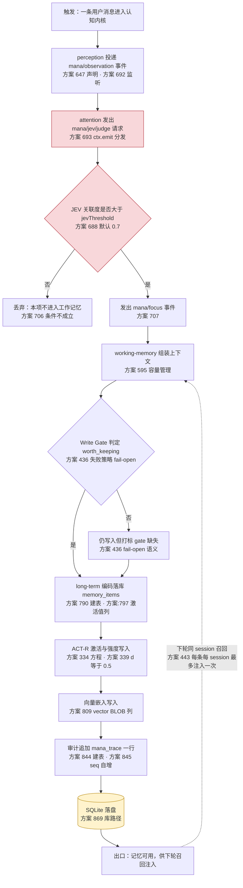
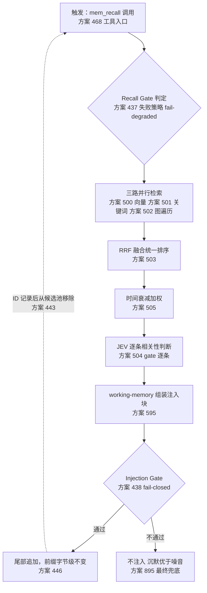
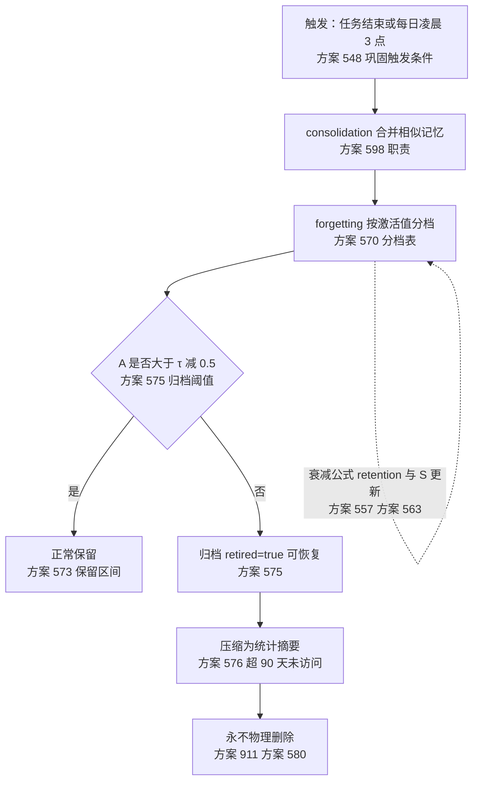

# Mana · MA-F01 认知闭环主链（L2 · 设计态）

> **读法一行**：从一条用户消息进入，沿 `observation → jev/judge → focus → working-memory → Write Gate → memory_items → 向量嵌入` 走完，看**每一步靠什么触发、靠什么判分支、最终写到哪张表**。
> **⚠ 本档性质**：Mana **零源码**，本档提炼自**设计文档**（《Mana v5 方案》+《落地册》），**行号指向文档而非源码**。凡方案声明与实测冲突处，以《落地册》实测为准并标注。行号口径见 L1 档 §开头声明（`方案:N` = `docs/mana-v5-plan.md` 物理行号；`册:N` = `docs/mana-rollout-plan.md` 物理行号）。

---

## 1. 五问速答

| 问题 | 答案 | 依据 |
|---|---|---|
| **入口在哪** | `mana/observation` 事件（前五识·感知产物）；监听器由 `attention` 插件在 `apply()` 里注册 | `方案:692`（`ctx.on('mana/observation', …)`）、`方案:647`（事件声明） |
| **数据从哪来** | 上游 `perception` 采集分块后经事件总线投递；本链只消费事件载荷，不直连采集实现 | `方案:774`（services 之间通过事件通信，不直接 import 实现）、`方案:593` |
| **循环在等什么** | 等 `mana/jev/judged` 旁路事件的判定结果——**这是本链最大的结构风险**：请求用 `emit` 发出（不等返回），结果只能靠第二条事件带回 | `方案:693`（`ctx.emit`）、`方案:703`（监听 `judged`）、`方案:632`（emit 不等待、不收集返回值） |
| **分支在判什么** | ① JEV 关联度是否 > `jevThreshold`（默认 0.7）；② Write Gate 的 `worth_keeping` 是否为真——**两者的默认行为相反**（前者丢弃、后者 fail-open 仍写入） | `方案:688`、`方案:706`、`方案:436` |
| **最终写到哪** | `memory_items` 表（主表）+ `mana_trace` 审计表；库路径 `$DSH_HOME/memory/mana.db` | `方案:790`、`方案:844`、`方案:869` |

---

## 2. 主链（贯通式）

**两个必须看懂的告警点**（红框）：

1. **`JUDGE` 是死契约**：`mana/jev/judge` 声明为 waterfall（签名带 `next`，`方案:656`），示例却用 `emit` 分发（`方案:693`）。按 `方案:632`，`emit` **不等待、不收集返回值** ⇒ 判定结果**结构上无法从该路径返回**，只能靠 `方案:657` 的旁路事件 `mana/jev/judged` 带回。且关联键不一致：请求用 `id`（`方案:694`）、结果用 `requestId`（`方案:707`）。⇒ 谁把观察型监听器挂到该事件上而不调 `next()`，下游默认行为会被**静默吞掉**（`方案:640` 的纪律只活在文档里）。
2. **`Q1` 与 `Q2` 的失败策略方向相反**：`Injection Gate` 是 fail-closed（不注入，`方案:438`），`Write Gate` 是 fail-open（仍写入，`方案:436`）。⇒ **「没注入」与「没记住」在日志上必须可分辨**，否则「记忆丢了」查不出来。

---

## 3. 下轮召回注入链（Flow B · 与主链共用 working-memory）

**⚠ 三路检索在本机没有数据层落点**：`方案:500` 的向量路由依赖 sqlite-vec，但本机实测**零命中**，且 `方案:790` 起的六张表 DDL 内 `VIRTUAL TABLE` / `fts5` / `journal_mode` / `PRAGMA` **全为 0**（`册:72` 逐项实测：DDL 块行 789–864）⇒ §7.1 的三路检索与 vec0 决策**在数据层没有任何落点**。落地册的对策是**改走纯 JS 通道**（复用既有 `vec.js`，`册:394`），sqlite-vec 降为可选加速（`册:403`）。

---

## 4. 巩固/遗忘链（Flow C · 定时触发）

**⚠ 本链是 G10 的现场**：`方案:911` 声明「物理删除永不发生」，`方案:904` 又声明「插件重启后从 `mana_trace` 回放」⇒ 卸载插件后 DB 行仍在、重注入即回放旧 trace（`册:176`）。**执行者以为「卸载即回滚」是错的**：回滚必须双层（插件层 + 数据层）。同时本链是「记忆爆炸」这一故障模式（`方案:979` 对策列 = 衰减 + 归档 + 压缩，**全部由本链承担**）的**唯一抑制机制**——它因依赖缺失静默停摆时，没有任何字段能证明「它没跑」；修法见 `册:481`（未运行必须写 `mana/plugin/inactive`），落点判据见 `册:536`（该条是**正向**判据，与「卸载后不再产生新行」的**反证**判据方向相反，**不得混写成一条**）。

---

## 5. 锚定自检

| 类别 | 结果 |
|---|---|
| 索引内文件 ✓ | **0**（Mana 未接入 nav 模型） |
| 索引外文件 ⚠ | `docs/mana-v5-plan.md`、`docs/mana-rollout-plan.md`（本档全部依据） |
| 行锚机检 | ✅ 见 §6（100% 命中才许交付） |

---

## 6. 与历史材料不符之处

| # | 历史说法 | 本档事实 | 依据 |
|---|---|---|---|
| 1 | 方案 §9.4 的 attention 示例是「标准写法」 | 它**违反**自己的 waterfall 纪律：`emit` 分发带 `next` 的契约 | `方案:656`、`方案:693`、`方案:640` |
| 2 | `forgetting`/`consolidation` 是 `long-term` 的下游 | 它们应是 `long-term` 的**维护者**（依赖方向写反了） | `册:480` |
| 3 | 向量只存一处 | `方案:809` 的 `vector BLOB` 与 §7 的 vec0 是**两套存法**，权威未定 | `册:478` |
| 4 | 「卸载即净」由 Cordis effect 回滚保证 | 只保证**插件层**；数据层不回收，且回放会复活旧状态 | `方案:885`、`册:176` |
| 5 | 验收看「插件在跑」 | 无效——`册:298` 明定三判据：装配判据（机制自证，**不足**）→ 行为判据 → **反证判据**（卸载后不再产生新行） | `册:298`、`册:284` |

---

> **交付状态**：本档与 `mana-overview.md` 同为**设计态**文档，**不是** L1 的源码派生拓扑。Mana 一旦产出源码，必须**重提炼**本档（届时行号口径改指向源码，并补跑 `l1` 门）。
