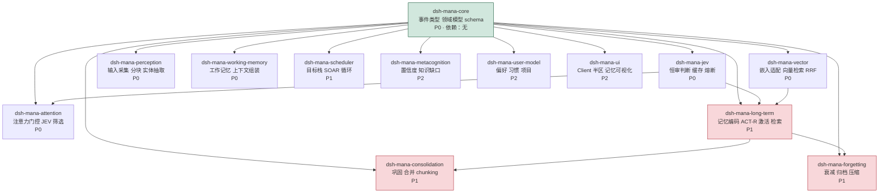

# Mana 项目总览（L1 · 设计态）

> **一句话导读**：Mana 是一个**尚无任何源码**的规划态项目——想用 13 个 DSH Bundle 插件把「ACT-R 记忆激活 + SOAR 目标栈 + JEV 快判断 + 向量混合检索」拼成认知型长期助手；本档给出它的**声明装配拓扑**与**已实测的阻断项**，供开发前对齐。
> **⚠ 本档性质（必读）**：Mana 全仓 **20 个文件、零源码**（无 `.ts/.js/.mjs` 业务实现，唯一脚本 `docs/_check-consistency.mjs` 是文档一致性检查器）。因此：
> - 本档是 **设计态**（declared/design-time）拓扑，**不是**从源码 import 派生的实测拓扑；
> - 依赖边来源 = 《Mana v5 方案》§9.1 表格 `依赖` 列**逐行摘录** + 《落地册》§3.2 的实链与 §4 的订正，**非** `nav_graph mode="impact"`；
> - L1 的 `edges`/`degrees` 机检门**在本项目不适用**（无源码可扫）——这是「门不适用」，**不是「门已通过」**。可执行的只有 `mermaid` 与 `anchors` 两门，结论见 §5。
> **行号口径声明**：本档及姊妹档 `<name>:NNN` 中 `docs/mana-v5-plan.md` = 该文件**物理行号**（UTF-8 无 CRLF，共 1241 行）；`docs/mana-rollout-plan.md` = 该文件**物理行号**（UTF-8 含 CRLF，共 832 行）。两册行号互不相同，引用必带文件名。

---

## 1. 当前事实底座

| 事实 | 值 | 取证方式 |
|---|---|---|
| 项目根 | `/home/lk/Mana`（= `D:\Mana` 软链指向同一处） | `ls -la /mnt/d/Mana` → 符号链接 |
| 版本控制 | 2 个 commit（`750f632` 迁移路径 / `4b38756` 建立回滚点） | `git log --oneline` |
| 工作区状态 | 干净（`git status --short` 无输出） | `git status --short` |
| 业务源码 | **0 个** | 全树 `find` 后按扩展名筛 |
| 设计文档 | 2 册（方案 1241 行 / 落地册 832 行） | 见 §2 现状表 |
| nav 治理 | **未接入**（`nav_graph mode="map"` 中 5 个项目无 Mana） | `nav_graph mode="map"` |
| 落地册自检 | `node docs/_check-consistency.mjs` → 退出码 0（20 项 PASS / 0 FAIL，README 自述） | `docs/_check-consistency.README.md` 行 15 |

**两册的关系（不是重复，是分层）**：方案册是**设计意图**，落地册是**可执行口径**；凡冲突处以落地册的**本机实测**为准，方案原件未被修改（`docs/mana-rollout-plan.md:5`）。

---

## 2. 现状表

| 件 | 行数 | 字节 | sha256（前 16） | 登记特征 |
|---|---|---|---|---|
| `docs/mana-v5-plan.md` | 1241 | 58676 | `d332c940f6e39645` | ⚠ 索引外 · 设计意图（v5.0） |
| `docs/mana-rollout-plan.md` | 832 | 107211 | `cb30be6500b59525` | ⚠ 索引外 · 可执行口径（v1.0） |
| `docs/_check-consistency.mjs` | 443 | 26318 | `742c7b4387bcdeb3` | ⚠ 索引外 · 文档一致性门（19 组/20 项） |
| `docs/_check-consistency.README.md` | 116 | 8029 | — | ⚠ 索引外 · 门的说明档 |
| `.roundtable/mana-rollout-2026-09-24/export.md` | 1549 | 187241 | `5ad8a3340cedcccd` | ⚠ 索引外 · 圆桌会议逐字稿导出 |

> 行数一律由 `node` 读 UTF-8 后按 `/\r?\n/` 切分计得（`docs/mana-rollout-plan.md` 为 CRLF，`docs/mana-v5-plan.md` 非 CRLF——由 `.gitattributes` 的 `* -text` 禁止 git 归一化行尾，行尾本身是有意义的）。

---

## 3. 声明装配拓扑（设计态）



**读法**：`A --> B` 读作「A 是 B 的 `inject` 依赖，B 在 A 就绪前不启动」。节点 13 个，边 17 条，与 §4 边表**逐条一一对应**。绿色 = 依赖根（方案声明「无依赖」）；红色 = 落地册已裁定的**方向订正点**（见边表订正列）。

> **宿主不在图中**：13 个插件都运行在 DSH 宿主内（`ctx.tools` / `ctx.llm` / `ctx.sessions` / `ctx.storage` / `ctx.client`，`方案:283`–`方案:284`），但**方案未把宿主声明为任何插件的 `inject` 依赖**（`方案:590` 明确 core 依赖为「无」）⇒ 按铁律「无依赖数据不画边」，宿主只以文字说明，不画成节点。

---

## 4. 依赖边表（逐条依据）

> 依据 = `dsh-mana-*` 插件清单表的 `依赖` 列原文；**订正列**记录落地册已裁定的方向修正。`方案` = `docs/mana-v5-plan.md`，`册` = `docs/mana-rollout-plan.md`。

| # | 边 | 方案依据 | 落地册订正 |
|---|---|---|---|
| 1 | core → jev | `方案:591` 「core」 | — |
| 2 | core → vector | `方案:592` 「core」 | — |
| 3 | core → perception | `方案:593` 「core」 | — |
| 4 | core → attention | `方案:594` 「core, jev」 | — |
| 5 | core → working-memory | `方案:595` 「core」 | — |
| 6 | core → long-term | `方案:596` 「core, jev, vector」 | — |
| 7 | core → scheduler | `方案:597` 「core」 | — |
| 8 | core → consolidation | `方案:598` 「core, long-term」 | `册:480` 对 long-term 改 `ctx.get` **可选**依赖，缺失即 no-op |
| 9 | core → forgetting | `方案:599` 「core, long-term」 | `册:480` 订正：`inject` **收敛为 `['mana-core']`**（只消费事件，不注入服务） |
| 10 | core → metacognition | `方案:600` 「core」 | — |
| 11 | core → user-model | `方案:601` 「core」 | — |
| 12 | core → ui | `方案:602` 「core」 | — |
| 13 | jev → attention | `方案:594` 「core, jev」 | — |
| 14 | jev → long-term | `方案:596` 「core, jev, vector」 | — |
| 15 | vector → long-term | `方案:596` 「core, jev, vector」 | — |
| 16 | long-term → consolidation | `方案:598` 「core, long-term」 | 同 #8 |
| 17 | long-term → forgetting | `方案:599` 「core, long-term」 | 同 #9 |

**⚠ 无依据的边一律不画**：`scheduler` / `metacognition` / `user-model` / `ui` 出度为 0——方案未声明它们的下游，故图中为叶节点。

**⚠ 成因已在册中裁定**：边 #8/#16 与 #9/#17 的方向问题不是笔误，而是**「维护者被写成了依赖者」**——`forgetting`/`consolidation` 本应是 `long-term` 的维护者（`册:480` 原文「它们是 long-term 的维护者却成了依赖者」）。这条是**设计缺陷而非实现缺陷**，修在阶段 0 契约。订正后这两条 `long-term → forgetting/consolidation` 的**服务注入边消失**，仅保留事件消费关系。

---

## 5. 机检门结论（诚实口径）

| 门 | 状态 | 说明 |
|---|---|---|
| `l1`（edges + degrees） | **不适用** | 门靠扫源码 import 建边。本项目 **0 源码** ⇒ 无 import 可扫。**本条不构成通过** |
| `mermaid` | ✅ 通过 | L1 档 1 个块（13 节点 / 17 边）；L2 档 3 个块（15/10/8 节点）逐块复验，均无孤立节点、括号引号平衡、边端点均已定义 |
| `anchors` | ✅ 100% | 92 条锚点逐条命中（构造期自检 92/92），且经**变异测试**证伪能力：注入 2 条假锚点后报红 2 条、通过率降至 97.8% |

> **为什么不伪造一套边来喂门**：`arch-check.mjs` 的 `l1` 门存在的理由就是「把『不编造』从口号变成判据」。给一个零源码项目跑 import 扫描，只会得到 **0 条边**——把它记成「通过」正是本技能最要防的**假绿**。故此处显式记为**不适用**。

> **⚠ L1 级发现（工具静默失败，与 Mana 无关但本轮实测撞到）**：`arch-check.mjs` 第 14 行注释声明「退出码：0 = 全门通过；1 = 任一门失败」，但**全文零 `process.exit` / `process.exitCode`**（grep 实测 0 处），`FAILED` 变量在 243 行之外**再无消费点** ⇒ **所有 ⛔ 失败仍以 0 退出**。本轮实测：变异档打印 2 条 ⛔、通过率 97.8%，`EXIT=0`；全通过档同样 `EXIT=0` —— **两者不可区分**。凡以 `$?` 串接该门做 CI 判据者，均**恒绿**。
> 处置建议（**不在本技能写权限内**，故只报不改）：给该文件补 `process.exitCode = FAILED ? 1 : 0`（或 `if (FAILED) process.exit(1)`）置于末尾。**关闭命令**：无——这属 `D:\FF` 侧工具缺陷，已在 `D:\FF\.internal\arch\render\_PLAN-arch-docs-repair-2026-09-18.html` 中被独立记录为「门是假门」。

---

## 6. 已实测的阻断项（开发前必读）

> 来源：《落地册》§2 的 G1–G15 + §2.2 的 W-1–W-4，**按「会掩盖其他问题 / 让失败不可观测」排序**。下表列**会静默失败**的 15 条（G1–G12 + W-1–W-3）；G13–G15 与 W-4 属排期/选型/样板项，见每行末尾说明。

| 闸 | 一句话 | 落点 |
|---|---|---|
| G1 | 性能数字同机跨采样浮动 **1.2–13 倍** ⇒ 绝对毫秒不可进阈值列 | `册:167` |
| G2 | 方案 §14「检测方式」列 **0 条真有信号**（真信号 0 / 半真 3 / 愿望 7） | `册:168` |
| G3 | I1/I2 不变式**无可数之处**：六张表无 `session_id`/`turn_id` | `册:169` |
| G4 | `node:sqlite` 扩展加载窗口**只在开库瞬间**，后补不上且不报错 | `册:170` |
| G5 | 中文 FTS5 **静默归零**（`MATCH '末那识'` → 0，且「0 命中」与「库里没有」同形） | `册:171` |
| G6 | 示例用 `ctx.emit` 分发 waterfall 契约 ⇒ 首个事件即抛 `TypeError` | `册:172` |
| G7 | `busy_timeout` 默认 0 ⇒ 并发写立即失败，无事务封装 | `册:173` |
| G8 | 静默降级已有先例（`catch { return null }`），失败与「正常空结果」同形 | `册:174` |
| G9 | Mana 的 Injection Gate 与现有 shoucang 争**同一** `agent/pre-step` 扩展点 | `册:175` |
| G10 | 卸载 ≠ 数据回滚，且 `mana_trace` 回放会**复活旧状态** | `册:176` |
| G11 | 装配清单 ≠ 生效，空壳与真插件同形 ⇒ 骨架全绿而零行为 | `册:177` |
| G12 | 「直接复用」承诺不实：被点名的 6 个包本机**一个都没装** | `册:178` |
| W-1 | vec0 默认度量是 **L2 不是余弦**，不写即静默用错 | `册:224` |
| W-2 | vec0 `rowid` 必须 **BigInt**，同进程两套 id 语义 | `册:225` |
| W-3 | KNN 查询**必须带 LIMIT**，否则报 errcode 1 | `册:226` |

> **排序口径**：G1–G12 + W-1–W-3 按「会掩盖其他问题」优先排列，与《落地册》§2 原表顺序一致。**未列入本表的三项**：G13（JEV 承载方式，**已拍板**走本机 Ollama logprob）、G14（Top-50 fan-out 与 `<500ms` 目标脱节）、G15（存储目录与资源上限未定）——它们属**排期与选型项**，已于册中定案或落到阶段 1，不属「静默失效」类；W-4（样板测试依赖 `.gitattributes`）是**抄样板时的注意事项**，见 `册:227`。

**它们为什么排在最前**（册原文理由）：本项目**使用者只有一名、没有「用户报障」通道** ⇒ **测不出来的失败就是永久静默失效**。

---

## 7. 锚定自检

**索引内 ✓**：0 个（Mana 未接入 nav 模型）。
**索引外 ⚠**：本档 §2 全部 5 件 + 两册全文——即 **Mana 全项目**。

> 补登记命令（把 Mana 接入治理后再跑本技能，才能拿到实测依赖边）：
> ```
> nav_node target=MA-P01 layer=project name="Mana（末那识）"
> nav_node target=MA-M01 layer=module project=MA-P01 name="认知内核" features=MA-F01
> nav_node target=MA-F01 layer=feature project=MA-M01 name="认知闭环" files=docs/mana-v5-plan.md,docs/mana-rollout-plan.md
> nav_graph mode="coverage"
> ```

---

## 8. 与历史材料不符之处

| # | 历史说法 | 现码/现档事实 | 依据 |
|---|---|---|---|
| 1 | 方案 §15.3 称 5 个插件「可直接复用」 | 本机实测 **0 个存在**；唯一在 npm 真实存在的 `dsh-memory@0.1.0` 是**纯 FTS5 词法件** | `册:44` |
| 2 | 方案把 13 个插件画成**同层** | 实为 3 层深度，且层深 = **卸载爆炸半径** | `方案:250`–`方案:289` |
| 3 | 方案 §9.4 示例「能跑」 | 用 `emit` 分发 waterfall ⇒ 结构上无法返回判定结果 | `方案:656`、`方案:693`、`方案:703` |
| 4 | 「物理删除永不发生」被当作安全特性 | 它是 G10 的**成因**：卸载后数据仍在 ⇒ 回滚失败不可观测 | `方案:911`、`册:176` |
| 5 | 落地册姊妹稿写「17 批次」「关键路径 11」 | 均为**笔误**，逐行重数为 **18 批次**；关键路径分两种口径（8 / 10） | `册:249`、`册:246` |

---

`nav_graph mode="health"` 状态摘要：事件流 375 事件（seq 连续 ✓）· 项目 5 · 模块 8 · 功能 27 · 登记文件 154 · **未登记 3898** · **STALE 0** · 计数闸 3/3 一处（`feature:sc-gate-scan-scope`）· 治理可能被绕过 1 处（改动晚于登记 58 分钟，属 `/mnt/d/FF` 侧，**与本项目无关**）。
